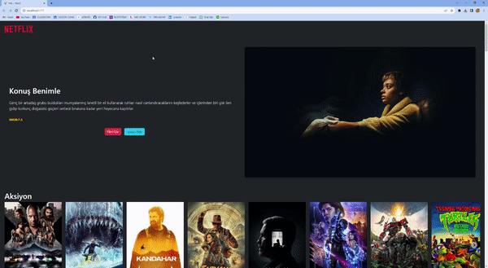

# Kütüphaneler

- react router-dom
- @splidejs/react-splide
- axios
- redux
- react-redux
- redux-thunk

# Kaynaklar

- API: https://developer.themoviedb.org/reference/intro/getting-started

- Resim Base Url : https://image.tmdb.org/t/p/original

# Yapılacaklar

- Redux ın kurulumunu yap
- populer film versini çek ve storeye aktar
- rastgele populer filmi seç ve "hero.jsx" de ekrana bas
- kategori verisini çek ve storeye aktar
- her bir kategori için ekrana o kategoriye ait filmleri listeleyecek bir bileşen `ListMovies.jsx` bas
  -- bu bileşende listelenecek kategorinin ismini ve o kategorye ait filmleri listele

<h5>Çalışır hali</h5>

